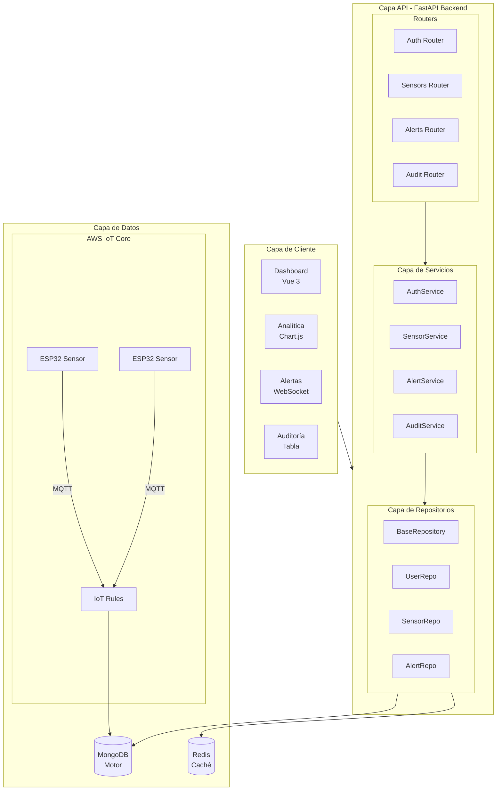

# AquaStat - Sistema de Monitoreo IoT de Calidad de Agua

<div align="center">


**Plataforma IoT para monitoreo de calidad de agua en tiempo real para cultivo de arándanos**

[](https://vuejs.org/)
[](https://www.typescriptlang.org/)
[](https://fastapi.tiangolo.com/)
[](https://www.python.org/)
[](https://www.mongodb.com/)
[](https://redis.io/)
[](https://www.docker.com/)
[](LICENSE)

[Características](#características) | [Inicio Rápido](#inicio-rápido) | [Arquitectura](#arquitectura) | [API](#documentación-api) | [Contribuir](#contribuir)

</div>

---

## Descripción General

**AquaStat** es una plataforma integral de monitoreo IoT diseñada específicamente para la gestión de calidad de agua en cultivos de arándanos chilenos. El sistema integra datos de sensores en tiempo real desde AWS IoT Core con predicciones de machine learning, alertas multicanal y trazabilidad completa de auditoría.

### Objetivos Principales

- **Monitoreo en Tiempo Real**: Seguimiento continuo de pH, conductividad eléctrica (CE), temperatura y nivel de agua
- **Analítica Predictiva**: Pronósticos basados en ML usando regresión lineal para toma de decisiones proactiva
- **Alertas Inteligentes**: Alertas multinivel (Info/Advertencia/Crítico) con notificaciones por Email y WhatsApp
- **Gestión de Usuarios**: Control de acceso basado en roles (Administrador/Operador) con autenticación JWT
- **Auditoría Completa**: Registro completo de eventos para cumplimiento y trazabilidad

### Optimizado para Arándanos Chilenos

| Parámetro | Rango Óptimo | Rango Advertencia | Rango Crítico |
|-----------|--------------|-------------------|---------------|
| **pH** | 5.0 - 5.5 | 4.5 - 6.0 | < 4.0 o > 6.5 |
| **CE** | 0.0 - 1.0 dS/m | 0.0 - 1.5 dS/m | > 2.0 dS/m |
| **Temperatura** | 15 - 30°C | 10 - 35°C | < 5°C o > 40°C |
| **Nivel de Agua** | 60 - 90% | 20 - 95% | < 10% o > 98% |

---

## Características

### Seguridad y Autenticación
- Autenticación basada en JWT con renovación segura de tokens
- Control de acceso basado en roles (RBAC): Administrador y Operador
- Recuperación de contraseña vía correo electrónico SMTP
- Middleware de limitación de tasa con límites específicos por rol
- Seguimiento de Request ID para depuración
- Cierre de sesión por inactividad con modal de advertencia

### Dashboard en Tiempo Real
- Métricas auto-actualizables cada 30 segundos
- Gráficos interactivos con Chart.js y capacidad de zoom
- Gráficos individuales por sensor para cada métrica
- Selector de rango temporal: 24h, 7 días, 30 días, rango personalizado
- Modo oscuro/claro con transiciones suaves
- Diseño responsivo para escritorio, tablet y móvil

### Predicciones con Machine Learning
- Modelo de regresión lineal entrenado con datos históricos
- Horizonte de predicción configurable (1-30 días)
- Período de retrospectiva configurable (1-90 días)
- Integración visual con líneas punteadas de predicción
- Alertas predictivas cuando valores futuros superan umbrales

### Sistema de Alertas Multinivel
- Monitoreo automático cada 6 minutos vía servicio en segundo plano
- Tres niveles de severidad: Info, Advertencia, Crítico
- Umbrales personalizables por métrica
- Canales de notificación:
  - Email SMTP con plantillas HTML profesionales
  - API de WhatsApp Business de Twilio
- Limitación: mínimo 15 minutos entre alertas duplicadas
- Descarte manual con atribución de usuario
- Historial completo de alertas con paginación

### Dashboard de Analítica
- Resúmenes estadísticos por sensor
- Detección y visualización de anomalías
- Análisis comparativo entre períodos de tiempo
- Generación de reportes PDF con rangos de fecha personalizados

### Auditoría y Cumplimiento
- Registro automático de todas las acciones críticas del sistema
- Eventos rastreados: Login/Logout, CRUD de usuarios, Gestión de alertas, Cambios de configuración
- Metadatos enriquecidos: Usuario, timestamp, dirección IP, detalles de acción
- Filtrado avanzado por tipo de acción, usuario, rango de fechas
- Listo para exportar en auditorías externas

### Integración IoT
- AWS IoT Core con autenticación de certificados TLS
- Comunicación MQTT para sensores ESP32
- Validación de esquema para datos entrantes
- Almacenamiento MongoDB optimizado con índices

---

## Arquitectura



### Stack Tecnológico

| Componente | Tecnología | Propósito |
|------------|------------|-----------|
| **Frontend** | Vue 3.5 + TypeScript | SPA con Composition API |
| **UI Framework** | Tailwind CSS | Estilos utility-first |
| **Gráficos** | Chart.js + vue-chartjs | Visualización de datos |
| **Backend** | FastAPI 0.115 | Framework API asíncrono |
| **Base de Datos** | MongoDB 7.0 | Almacenamiento de documentos |
| **Caché** | Redis 7.0 | Sesiones y rate limiting |
| **IoT** | AWS IoT Core | Ingestión de datos de sensores |
| **Email** | SMTP (Gmail/SES) | Notificaciones por correo |
| **WhatsApp** | Twilio API | Alertas móviles |
| **Contenedores** | Docker + Compose | Despliegue |

---

## Inicio Rápido

### Requisitos Previos

- Docker 24.0+
- Docker Compose 2.0+
- Node.js 20+ (para desarrollo local)
- Python 3.11+ (para desarrollo local)

### Instalación con Docker (Recomendado)

```bash
# Clonar el repositorio
git clone https://github.com/KsmBlitz/UNAB-ProyectoDeTitulo.git
cd UNAB-ProyectoDeTitulo

# Copiar variables de entorno de ejemplo
cp Backend/.env.example Backend/.env
cp Frontend/.env.example Frontend/.env

# Editar las variables de entorno
nano Backend/.env

# Iniciar todos los servicios
docker-compose up -d

# Ver los logs
docker-compose logs -f
```

### Desarrollo Local

#### Backend
```bash
cd Backend

# Crear entorno virtual
python -m venv venv
source venv/bin/activate  # Linux/Mac
# .\venv\Scripts\activate  # Windows

# Instalar dependencias
pip install -r requirements.txt

# Ejecutar servidor de desarrollo
uvicorn main:app --reload --port 8000
```

#### Frontend
```bash
cd Frontend

# Instalar dependencias
npm install

# Ejecutar servidor de desarrollo
npm run dev
```

### Acceso a la Aplicación

| Servicio | URL | Descripción |
|----------|-----|-------------|
| **Frontend** | http://localhost:5173 | Aplicación Vue.js |
| **Backend API** | http://localhost:8000 | API FastAPI |
| **API Docs** | http://localhost:8000/docs | Swagger UI |
| **ReDoc** | http://localhost:8000/redoc | Documentación alternativa |

---

## Variables de Entorno

### Backend (`Backend/.env`)

```env
# Base de Datos
MONGO_URL=mongodb://localhost:27017
DATABASE_NAME=aquastat

# Redis
REDIS_URL=redis://localhost:6379

# Seguridad
SECRET_KEY=tu-clave-secreta-super-segura-aqui
ALGORITHM=HS256
ACCESS_TOKEN_EXPIRE_MINUTES=30

# Email SMTP
SMTP_HOST=smtp.gmail.com
SMTP_PORT=587
SMTP_USER=tu-email@gmail.com
SMTP_PASSWORD=tu-contraseña-de-aplicacion
SMTP_FROM=AquaStat <tu-email@gmail.com>

# Twilio WhatsApp
TWILIO_ACCOUNT_SID=tu-account-sid
TWILIO_AUTH_TOKEN=tu-auth-token
TWILIO_WHATSAPP_FROM=whatsapp:+14155238886
TWILIO_WHATSAPP_TO=whatsapp:+56912345678

# AWS IoT
AWS_IOT_ENDPOINT=tu-endpoint.iot.us-east-1.amazonaws.com
AWS_IOT_CLIENT_ID=aquastat-backend

# Logging
LOG_LEVEL=INFO
```

### Frontend (`Frontend/.env`)

```env
VITE_API_URL=http://localhost:8000
VITE_WS_URL=ws://localhost:8000
```

---

## Documentación API

### Autenticación

| Método | Endpoint | Descripción |
|--------|----------|-------------|
| `POST` | `/auth/login` | Iniciar sesión |
| `POST` | `/auth/logout` | Cerrar sesión |
| `POST` | `/auth/refresh` | Renovar token |
| `POST` | `/auth/forgot-password` | Solicitar recuperación |
| `POST` | `/auth/reset-password` | Restablecer contraseña |

### Sensores

| Método | Endpoint | Descripción |
|--------|----------|-------------|
| `GET` | `/sensors` | Listar todos los sensores |
| `GET` | `/sensors/{id}` | Obtener sensor por ID |
| `GET` | `/sensors/{id}/data` | Obtener datos históricos |
| `GET` | `/sensors/{id}/latest` | Obtener última lectura |
| `GET` | `/sensors/{id}/predictions` | Obtener predicciones ML |

### Alertas

| Método | Endpoint | Descripción |
|--------|----------|-------------|
| `GET` | `/alerts` | Listar alertas activas |
| `GET` | `/alerts/history` | Historial de alertas |
| `POST` | `/alerts/{id}/dismiss` | Descartar alerta |
| `GET` | `/alerts/config` | Obtener configuración |
| `PUT` | `/alerts/config` | Actualizar umbrales |

### Usuarios (Solo Admin)

| Método | Endpoint | Descripción |
|--------|----------|-------------|
| `GET` | `/users` | Listar usuarios |
| `POST` | `/users` | Crear usuario |
| `PUT` | `/users/{id}` | Actualizar usuario |
| `DELETE` | `/users/{id}` | Eliminar usuario |

### Auditoría

| Método | Endpoint | Descripción |
|--------|----------|-------------|
| `GET` | `/audit` | Listar registros de auditoría |
| `GET` | `/audit/actions` | Tipos de acciones disponibles |

---

## Estructura del Proyecto

```
UNAB-ProyectoDeTitulo/
├── Backend/
│   ├── app/
│   │   ├── config/          # Configuración de BD y settings
│   │   ├── middleware/      # Rate limiting, request ID
│   │   ├── models/          # Modelos Pydantic
│   │   ├── repositories/    # Capa de acceso a datos
│   │   ├── routes/          # Endpoints de la API
│   │   ├── services/        # Lógica de negocio
│   │   └── utils/           # Utilidades compartidas
│   ├── certificates/        # Certificados AWS IoT
│   ├── scripts/             # Scripts de mantenimiento
│   ├── tests/               # Tests unitarios
│   ├── main.py              # Punto de entrada
│   ├── requirements.txt     # Dependencias Python
│   └── Dockerfile
│
├── Frontend/
│   ├── src/
│   │   ├── assets/          # Recursos estáticos
│   │   ├── auth/            # Guard de autenticación
│   │   ├── components/      # Componentes Vue reutilizables
│   │   ├── composables/     # Composables Vue
│   │   ├── config/          # Configuración de la app
│   │   ├── router/          # Vue Router
│   │   ├── stores/          # Pinia stores
│   │   ├── types/           # Tipos TypeScript
│   │   ├── utils/           # Funciones de utilidad
│   │   └── views/           # Vistas/Páginas
│   ├── public/              # Archivos públicos
│   ├── package.json
│   ├── vite.config.ts
│   └── Dockerfile
│
├── docs/                    # Documentación adicional
├── scripts/                 # Scripts de automatización
├── docker-compose.yml       # Orquestación de contenedores
└── README.md
```

---

## Testing

### Backend

```bash
cd Backend

# Ejecutar todos los tests
pytest

# Con cobertura
pytest --cov=app --cov-report=html

# Tests específicos
pytest tests/test_auth.py -v
```

### Frontend

```bash
cd Frontend

# Tests unitarios
npm run test:unit

# Tests e2e
npm run test:e2e
```

---

## Scripts de Mantenimiento

El backend incluye varios scripts útiles en `Backend/scripts/`:

| Script | Propósito |
|--------|-----------|
| `create_indexes.py` | Crear índices de MongoDB |
| `migrate_alert_history.py` | Migrar datos de alertas |
| `normalize_alerts.py` | Normalizar formato de alertas |
| `fix_sensor_data_timestamps.py` | Corregir timestamps |
| `collect_alerts_report.py` | Generar reporte de alertas |

```bash
# Ejemplo de uso
cd Backend
python scripts/create_indexes.py
```

---

## Contribuir

1. Fork el repositorio
2. Crear rama de feature (`git checkout -b feature/nueva-caracteristica`)
3. Commit cambios (`git commit -m 'Agregar nueva característica'`)
4. Push a la rama (`git push origin feature/nueva-caracteristica`)
5. Abrir Pull Request

### Guía de Estilo

- **Python**: Seguir PEP 8, usar type hints
- **TypeScript**: ESLint + Prettier configurados
- **Commits**: Mensajes descriptivos en español o inglés
- **Comentarios en código**: Inglés (para consistencia técnica)

---

## Licencia

Este proyecto fue desarrollado como parte de un proyecto de título académico para la Universidad Andrés Bello (UNAB), Chile.

---

## Autor

**Desarrollador**: Vicente Estay Valdivia

**Institución**: Universidad Andrés Bello (UNAB)

**Carrera**: Ingeniería en Computación e Informática

**Año**: 2024-2025

---

<div align="center">

**[Volver arriba](#aquastat---sistema-de-monitoreo-iot-de-calidad-de-agua)**

Desarrollado en Chile

</div>
