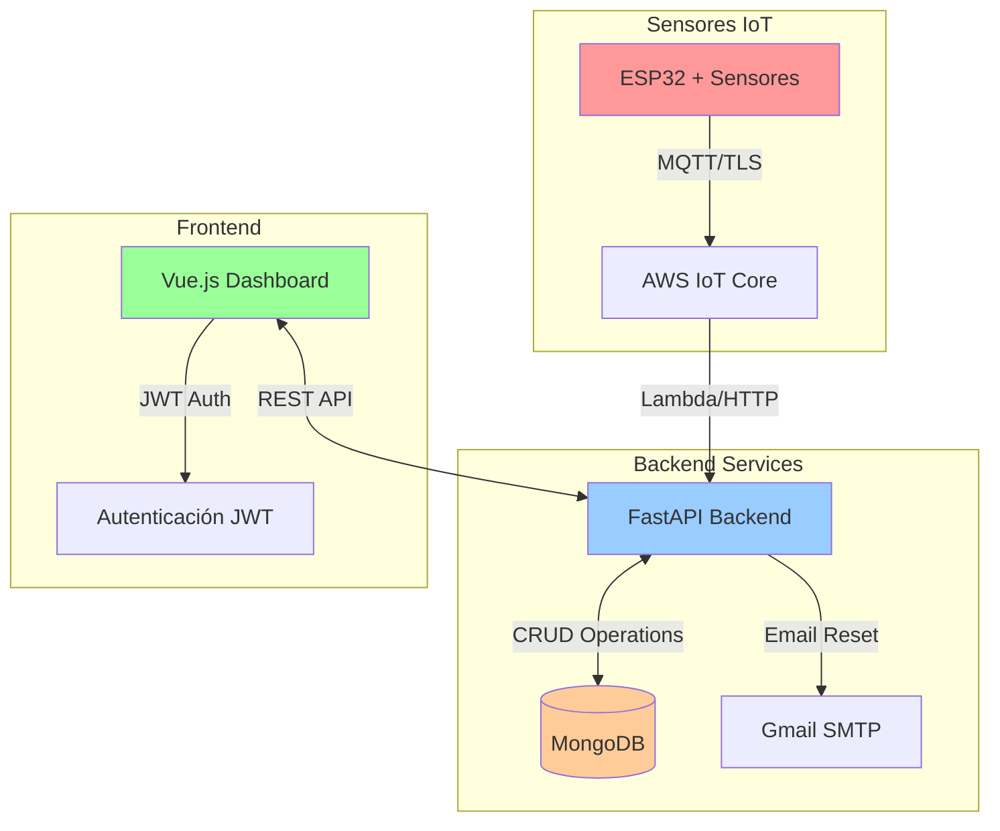

# Sistema IoT para Monitoreo de Riego de Arándanos


## Descripción

Sistema completo de monitoreo IoT para cultivos de arándanos en Chile, que integra sensores AWS IoT, dashboard web en tiempo real, y sistema de alertas inteligentes. Diseñado específicamente para optimizar el riego y mantener condiciones óptimas para el cultivo de arándanos (pH 5.0-5.5, conductividad <1.5 dS/m).

### Objetivos del Sistema
- **Monitoreo continuo** de parámetros críticos del agua de riego
- **Alertas proactivas** cuando los valores salen de rangos óptimos
- **Gestión centralizada** para administradores y operarios
- **Trazabilidad completa** de eventos y acciones del sistema

---

## Vista Previa del Sistema

### Dashboard Principal
- Métricas en tiempo real (pH, Conductividad, Temperatura, Nivel de Agua)
- Indicadores visuales por colores según rangos óptimos
- Alertas críticas y de advertencia
- Navegación responsiva para móviles

### Sistema de Alertas
- Notificaciones en tiempo real cuando se superan umbrales
- Gestión de alertas con dismissal manual
- Historial completo para auditoría
- Período de gracia de 1 hora para evitar spam

### Gestión de Usuarios
- Sistema de roles (Administrador/Operario)
- Autenticación JWT segura
- Recuperación de contraseña vía email
- CRUD completo de usuarios para admins

---

## Arquitectura del Sistema




## Funcionalidades Implementadas

### Autenticación y Seguridad
- **Login/Logout** con JWT tokens seguros
- **Recuperación de contraseña** vía email SMTP
- **Sistema de roles** diferenciados (Admin/Operario)
- **Sesiones persistentes** con renovación automática

### Dashboard en Tiempo Real 
- **Métricas actualizadas** cada 30 segundos automáticamente
- **Cards responsivos** con indicadores de estado por colores
- **Navegación intuitiva** entre módulos del sistema
- **Diseño móvil** optimizado para tablets y smartphones

### Sistema de Alertas Avanzado
- **Detección automática** de condiciones críticas cada 6 minutos
- **Alertas por niveles:** Info, Warning, Critical
- **Dismissal manual** con trazabilidad de quién cerró cada alerta
- **Período de gracia** de 1 hora para evitar alertas duplicadas
- **Historial completo** con duración y resolución de cada evento

### Configuración Dinámica de Umbrales
- **Interface administrativa** para configurar rangos óptimos
- **Validación en tiempo real** de valores ingresados
- **Persistencia en MongoDB** de todas las configuraciones
- **Umbrales específicos** para arándanos chilenos:
  - pH: 4.5 - 6.5 (óptimo: 5.0-5.5)
  - Conductividad: < 1.5 dS/m
  - Temperatura: 10°C - 35°C
  - Nivel de agua: 40% - 95%

### Gestión de Usuarios (Solo Admin)
- **CRUD completo** de usuarios del sistema
- **Asignación de roles** y permisos granulares
- **Validación de emails únicos** y datos requeridos
- **Hash seguro** de contraseñas con bcrypt

### Conectividad IoT
- **AWS IoT Core** preparado para sensores ESP32
- **Certificados TLS** para comunicación segura
- **Estructura MongoDB** optimizada para datos de sensores
- **APIs REST** listas para integración con hardware

---

## Tecnologías Utilizadas

| Área                 | Tecnología                                               |
| -------------------- | -------------------------------------------------------- |
| **Frontend** | Vue 3 (Composition API), TypeScript, Vite, Chart.js      |
| **Backend** | Python 3, FastAPI, Pydantic, Uvicorn                     |
| **Base de Datos** | MongoDB                                                  |
| **Comunicación IoT** | MQTT (Broker como Mosquitto/VerneMQ)                     |
| **Machine Learning** | Scikit-learn (SVM) o XGBoost                             |
| **DevOps** | Docker, Docker Compose                                   |
| **Calidad de Código** | ESLint, Prettier                                         |

---

## Instalación y Despliegue

### Prerrequisitos
- **Docker** y **Docker Compose** instalados
- **Git** para clonar el repositorio
- **Gmail** o servidor SMTP para recuperación de contraseñas

### Configuración del Entorno

1. **Clonar el repositorio:**
   ```bash
   git clone <URL_DEL_REPOSITORIO>
   cd UNAB-ProyectoDeTitulo
   ```

2. **Configurar variables de entorno del Backend:**
   Crear archivo `.env` en la carpeta `Backend/` con:
   ```env
   # Base de datos MongoDB
   MONGODB_URL=mongodb://mongodb:27017/iot_monitoring

   # JWT Seguridad
   JWT_SECRET_KEY=<tu_clave_secreta_muy_segura>
   JWT_ALGORITHM=HS256
   JWT_ACCESS_TOKEN_EXPIRE_MINUTES=30

   # Configuración SMTP para recuperación de contraseñas
   SMTP_SERVER=smtp.gmail.com
   SMTP_PORT=587
   SMTP_USERNAME=<tu_email@gmail.com>
   SMTP_PASSWORD=<tu_app_password_de_gmail>
   SMTP_FROM_EMAIL=<tu_email@gmail.com>

   # AWS IoT Core (opcional, para sensores reales)
   AWS_IOT_ENDPOINT=<tu_endpoint.iot.region.amazonaws.com>
   AWS_ACCESS_KEY_ID=<tu_access_key>
   AWS_SECRET_ACCESS_KEY=<tu_secret_key>
   ```

### Despliegue con Docker

3. **Levantar todos los servicios:**
   ```bash
   # Construcción limpia (recomendado en primer despliegue)
   docker-compose up --build --force-recreate

   # Para desarrollo posterior
   docker-compose up -d
   ```

4. **Crear usuario administrador inicial:**
   ```bash
   # Acceder al contenedor del backend
   docker exec -it <nombre_contenedor_backend> python -c "
   from main import create_admin_user
   import asyncio
   asyncio.run(create_admin_user())
   "
   ```

### Acceso al Sistema

5. **URLs de la aplicación:**
   - **Frontend (Dashboard):** http://localhost:3000
   - **Backend API:** http://localhost:8000  
   - **Documentación Swagger:** http://localhost:8000/docs
   - **MongoDB:** localhost:27017

6. **Credenciales por defecto:**
   - **Email:** admin@iot.com
   - **Contraseña:** admin123
   - **Rol:** Administrador

---

## Documentación de APIs

### Endpoints de Autenticación

| Método | Endpoint | Descripción |
|--------|----------|-------------|
| `POST` | `/api/auth/login` | Iniciar sesión con email/contraseña |
| `POST` | `/api/auth/logout` | Cerrar sesión y invalidar JWT |
| `POST` | `/api/auth/forgot-password` | Solicitar recuperación de contraseña |
| `GET` | `/api/auth/validate-reset-token/{token}` | Validar token de recuperación |
| `POST` | `/api/auth/reset-password` | Actualizar contraseña con token |

### Endpoints de Usuarios (Solo Admin)

| Método | Endpoint | Descripción |
|--------|----------|-------------|
| `GET` | `/api/users/` | Listar todos los usuarios |
| `POST` | `/api/users/` | Crear nuevo usuario |
| `PUT` | `/api/users/{user_id}` | Actualizar datos de usuario |
| `DELETE` | `/api/users/{user_id}` | Eliminar usuario del sistema |

### Endpoints de Alertas

| Método | Endpoint | Descripción |
|--------|----------|-------------|
| `GET` | `/api/alerts/` | Obtener alertas activas |
| `GET` | `/api/alerts/history/` | Historial completo de alertas |
| `POST` | `/api/alerts/{alert_id}/dismiss` | Marcar alerta como resuelta |
| `GET` | `/api/alerts/thresholds/` | Obtener configuración de umbrales |
| `PUT` | `/api/alerts/thresholds/` | Actualizar umbrales (Solo Admin) |

### Endpoints de Dashboard

| Método | Endpoint | Descripción |
|--------|----------|-------------|
| `GET` | `/api/dashboard/metrics/` | Métricas actuales del sistema |
| `GET` | `/api/sensors/latest/` | Últimas lecturas de sensores |
| `GET` | `/api/sensors/history/` | Datos históricos para gráficos |

---

## Estructura del Proyecto

```
UNAB-ProyectoDeTitulo/
├── Backend/                    # API FastAPI + Python
│   ├── main.py                # Servidor principal con todos los endpoints
│   ├── models/                # Modelos de datos y validación
│   ├── certificates/          # Certificados TLS para AWS IoT
│   ├── requirements.txt       # Dependencias de Python
│   └── Dockerfile            # Imagen Docker del backend
├── Frontend/                  # Dashboard Vue.js + TypeScript  
│   ├── src/
│   │   ├── views/            # Páginas principales del sistema
│   │   ├── components/       # Componentes reutilizables
│   │   ├── stores/          # Estado global (Pinia)
│   │   ├── auth/            # Manejo de autenticación
│   │   └── router/          # Configuración de rutas
│   ├── package.json         # Dependencias de Node.js
│   └── Dockerfile          # Imagen Docker del frontend
└── docker-compose.yml      # Orquestación completa del sistema
```

---

## Mantenimiento y Monitoreo

### Comandos Útiles de Docker

```bash
# Ver logs en tiempo real
docker-compose logs -f

# Reiniciar solo un servicio
docker-compose restart backend

# Limpiar cache y reconstruir
docker system prune -a --volumes
docker-compose up --build --force-recreate

# Acceder a MongoDB directamente
docker exec -it <mongo_container> mongosh iot_monitoring
```

### Verificación del Sistema

```bash
# Verificar salud del backend
curl http://localhost:8000/health

# Comprobar usuarios registrados
curl http://localhost:8000/api/users/ \
  -H "Authorization: Bearer <JWT_TOKEN>"

# Ver métricas del dashboard
curl http://localhost:8000/api/dashboard/metrics/
```

---

## Próximos Desarrollos

### Funcionalidades Planificadas
- [ ] **Integración ML:** Modelo predictivo para cultivo de arándanos
- [ ] **Sensores ESP32:** Conexión física con hardware IoT
- [ ] **Notificaciones Push:** Alertas instantáneas via WebSockets
- [ ] **Export/Import:** Datos históricos en CSV/Excel
- [ ] **Multi-tenancy:** Soporte para múltiples campos/fincas

### Mejoras Técnicas
- [ ] **Tests Automatizados:** Cobertura completa con pytest/vitest
- [ ] **CI/CD Pipeline:** Despliegue automatizado con GitHub Actions  
- [ ] **Monitoreo APM:** Métricas de rendimiento con Prometheus
- [ ] **Backup Automático:** Respaldo programado de MongoDB
- [ ] **HTTPS/SSL:** Certificados Let's Encrypt para producción

---


