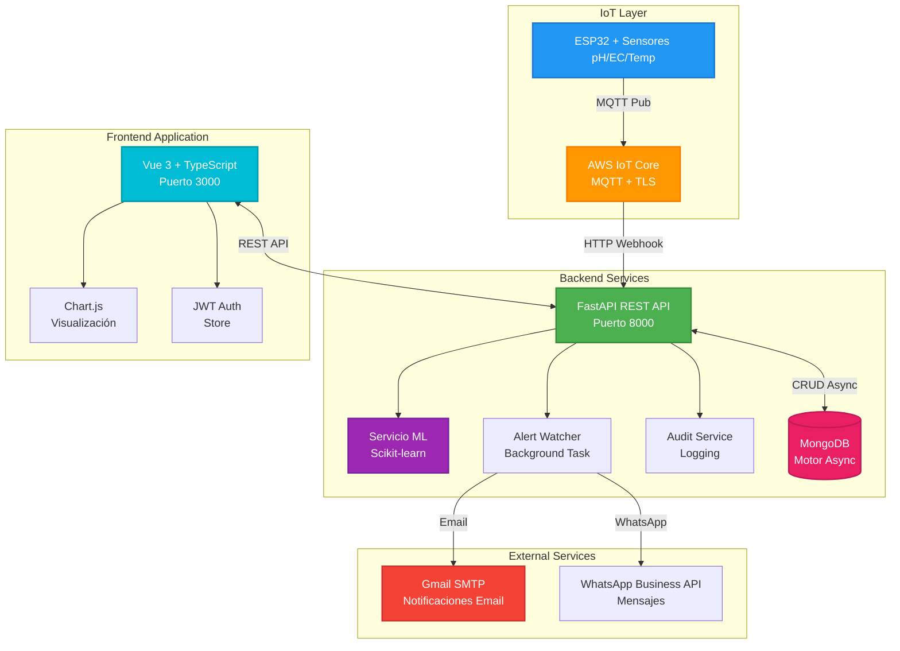

# Sistema IoT de Monitoreo de Calidad del Agua para Cultivos de Arándanos


## Descripción

Plataforma IoT empresarial completa para el monitoreo inteligente de calidad del agua en cultivos de arándanos en Chile. Integra sensores en tiempo real con AWS IoT Core, predicción mediante Machine Learning, sistema de alertas multinivel, y auditoría completa de eventos del sistema.

**Especializado para arándanos chilenos:** pH óptimo 5.0-5.5, conductividad eléctrica <1.5 dS/m.

### Objetivos Principales
- Monitoreo en tiempo real de pH, conductividad eléctrica, temperatura y nivel de agua
- Predicción inteligente con Machine Learning (regresión lineal) de valores futuros
- Sistema de alertas proactivo con notificaciones automáticas (Email/WhatsApp)
- Gestión de usuarios con roles (Admin/Operario) y autenticación JWT
- Auditoría completa de todas las acciones críticas del sistema
- Visualización avanzada con gráficos históricos y tendencias predictivas

---

## Características Implementadas

### Autenticación y Seguridad
- Login/Logout JWT con tokens seguros y renovación automática
- Recuperación de contraseña vía SMTP (Gmail/personalizado)
- Sistema de roles RBAC: Administrador y Operario con permisos granulares
- Hash bcrypt para contraseñas con salt rounds configurables
- Protección de rutas en frontend y backend con middleware
- Validación de tokens y manejo de expiración automático

### Dashboard en Tiempo Real
- Métricas actualizadas cada 30 segundos automáticamente
- Cards responsivos con indicadores de estado por colores (verde/amarillo/rojo)
- Gráficos históricos interactivos con Chart.js y zoom
- Gráficos individuales para cada métrica (pH, EC, Temperatura)
- Selector de rangos: Últimas 24h, 7 días, 30 días, rango personalizado
- Modo claro/oscuro persistente con transiciones suaves
- Diseño responsive optimizado para desktop, tablet y móvil

### Predicción con Machine Learning
- Modelo de regresión lineal entrenado con datos históricos
- Predicción de pH y Conductividad para los próximos N días (configurable)
- Configuración dinámica: Días a predecir (1-30) y días históricos (1-90)
- Visualización integrada de predicciones en gráficos con línea punteada
- Detección de valores críticos en predicciones futuras
- Alertas predictivas cuando se prevén valores fuera de rango
- Modal de configuración con validación en tiempo real
- Registro en auditoría de cambios en parámetros del modelo

### Sistema de Alertas Multinivel
- Detección automática cada 6 minutos mediante servicio de fondo
- Tres niveles de severidad: Info (azul), Warning (amarillo), Critical (rojo)
- Umbrales personalizables por métrica y nivel
- Notificaciones automáticas:
  - Email SMTP con plantillas HTML profesionales
  - WhatsApp Business API (preparado para integración)
- Período de gracia: 1 hora para evitar alertas duplicadas
- Dismissal manual con registro de quién cerró cada alerta
- Historial completo con filtros por severidad, métrica y fecha
- Estados: Activa, Resuelta, Auto-resuelta
- Duración calculada automáticamente al resolver

### Auditoría y Trazabilidad
- Registro automático de todas las acciones críticas del sistema
- Eventos auditados:
  - Login/Logout de usuarios
  - Creación/Edición/Eliminación de usuarios
  - Cambios en configuración de alertas
  - Dismissal de alertas con usuario responsable
  - Actualización de parámetros del modelo ML
- Metadata completa: Usuario, timestamp, IP, detalles de la acción
- Filtros avanzados: Por acción, usuario, rango de fechas
- Interfaz visual con badges de colores por tipo de evento
- Exportable para auditorías externas (preparado)

### Gestión de Usuarios (Solo Administradores)
- CRUD completo con interfaz moderna
- Validación robusta: Emails únicos, campos requeridos, formato correcto
- Asignación de roles con permisos diferenciados
- Deshabilitación de usuarios sin eliminación permanente
- Tabla interactiva con búsqueda y paginación
- Modales de creación/edición con feedback visual
- Confirmación de acciones críticas (eliminar usuario)

### Conectividad IoT
- AWS IoT Core configurado con certificados TLS
- Comunicación MQTT segura para sensores ESP32
- Ingesta de datos con validación de esquema
- Almacenamiento optimizado en MongoDB con índices
- APIs REST documentadas con Swagger/ReDoc
- WebSockets preparados para streaming en tiempo real

### Experiencia de Usuario
- Interfaz limpia con Tailwind CSS y componentes reutilizables
- Animaciones suaves en transiciones y modales
- Iconos profesionales con PrimeIcons
- Feedback visual inmediato en todas las acciones
- Mensajes de error descriptivos y accionables
- Loading states para operaciones asíncronas
- Toast notifications para eventos importantes
- Sidebar colapsable con navegación intuitiva

---

## Arquitectura del Sistema



### Flujo de Datos

1. **Sensores → Cloud:** ESP32 publica datos cada 5 minutos vía MQTT a AWS IoT Core
2. **Cloud → Backend:** AWS envía datos al endpoint FastAPI mediante HTTP
3. **Procesamiento:** FastAPI valida, procesa y almacena en MongoDB
4. **Monitoreo:** Alert Watcher analiza valores cada 6 minutos
5. **Notificaciones:** Si hay valores críticos, envía emails/WhatsApp automáticamente
6. **Predicción:** Modelo ML se entrena con datos históricos bajo demanda
7. **Visualización:** Frontend consulta APIs REST y actualiza gráficos cada 30s
8. **Auditoría:** Todas las acciones críticas se registran automáticamente

---

## Stack Tecnológico

| Categoría | Tecnologías |
|-----------|------------|
| **Frontend** | Vue 3 (Composition API), TypeScript, Vite, Tailwind CSS |
| **Gráficos** | Chart.js, vue-chartjs |
| **Backend** | Python 3.11, FastAPI, Pydantic v2, Uvicorn |
| **Base de Datos** | MongoDB 7.0, Motor (async driver) |
| **ML/Predicción** | Scikit-learn, NumPy, Regresión Lineal |
| **Autenticación** | JWT (python-jose), bcrypt, OAuth2 |
| **IoT** | AWS IoT Core, MQTT, TLS/SSL Certificates |
| **Notificaciones** | Gmail SMTP, WhatsApp Business API |
| **DevOps** | Docker, Docker Compose, Nginx |
| **Testing** | Pytest, Pytest-asyncio, Vitest (frontend) |
| **Code Quality** | ESLint, Prettier, Black (Python) |
| **Iconografía** | PrimeIcons, Lucide Icons |

---

## Estructura del Proyecto

```
UNAB-ProyectoDeTitulo/
├── Backend/                          # API FastAPI + Servicios
│   ├── main.py                      # Punto de entrada (deprecated, ver app/)
│   ├── requirements.txt             # Dependencias Python
│   ├── pytest.ini                   # Configuración de tests
│   ├── Dockerfile                   # Imagen Docker del backend
│   │
│   ├── app/                         # Aplicación modular FastAPI
│   │   ├── __init__.py
│   │   ├── config/                  # Configuración centralizada
│   │   │   ├── database.py          # Conexión MongoDB
│   │   │   └── settings.py          # Variables de entorno
│   │   │
│   │   ├── models/                  # Modelos de datos Pydantic
│   │   │   └── user.py              # Usuario con roles
│   │   │
│   │   ├── routes/                  # Endpoints REST API
│   │   │   ├── auth.py              # Login, logout, reset password
│   │   │   ├── users.py             # CRUD de usuarios
│   │   │   ├── sensors.py           # Datos de sensores + predicción
│   │   │   ├── alerts.py            # Gestión de alertas
│   │   │   └── audit.py             # Historial de auditoría
│   │   │
│   │   ├── services/                # Lógica de negocio
│   │   │   ├── auth.py              # Autenticación JWT
│   │   │   ├── email.py             # Envío de emails SMTP
│   │   │   ├── whatsapp.py          # Integración WhatsApp
│   │   │   ├── prediction.py        # Modelo ML (regresión)
│   │   │   ├── alert_watcher.py     # Servicio de alertas background
│   │   │   ├── audit.py             # Sistema de auditoría
│   │   │   └── notifications.py     # Notificaciones unificadas
│   │   │
│   │   └── utils/                   # Utilidades compartidas
│   │       └── dependencies.py      # Dependencias de FastAPI
│   │
│   ├── models/                      # Modelos de dominio
│   │   ├── alert_models.py          # Alertas y umbrales
│   │   └── audit_models.py          # Acciones de auditoría
│   │
│   ├── certificates/                # Certificados AWS IoT
│   │   ├── root-CA.pem
│   │   ├── device.pem.key.crt
│   │   └── private.pem.key
│   │
│   └── tests/                       # Tests unitarios y E2E
│       ├── conftest.py              # Fixtures compartidos
│       ├── test_auth.py
│       ├── test_notifications.py
│       └── test_routes.py
│
├── Frontend/                        # Aplicación Vue 3
│   ├── index.html
│   ├── package.json
│   ├── vite.config.ts               # Configuración Vite
│   ├── tsconfig.json                # TypeScript config
│   ├── tailwind.config.js           # Tailwind CSS
│   ├── nginx.conf                   # Nginx para producción
│   ├── Dockerfile                   # Imagen Docker del frontend
│   │
│   └── src/
│       ├── main.ts                  # Punto de entrada
│       ├── App.vue                  # Componente raíz
│       │
│       ├── views/                   # Páginas principales
│       │   ├── LoginView.vue
│       │   ├── ForgotPasswordView.vue
│       │   ├── ResetPasswordView.vue
│       │   ├── DashboardLayout.vue
│       │   ├── DashboardHomeView.vue
│       │   ├── UserManagementView.vue
│       │   ├── AlertsManagementView.vue
│       │   └── AuditLogView.vue
│       │
│       ├── components/              # Componentes reutilizables
│       │   ├── Sidebar.vue
│       │   ├── TheHeader.vue
│       │   ├── ThemeToggle.vue
│       │   ├── MetricCard.vue
│       │   ├── IndividualChart.vue  # Gráfico con predicción ML
│       │   ├── HistoricalChartGrid.vue
│       │   ├── SensorsTable.vue
│       │   ├── UsersTable.vue
│       │   ├── CreateUserModal.vue
│       │   └── EditUserModal.vue
│       │
│       ├── router/                  # Vue Router
│       │   └── index.ts             # Rutas y guards
│       │
│       ├── stores/                  # Pinia stores
│       │   ├── themeStore.ts
│       │   └── alertStore.ts
│       │
│       ├── auth/                    # Autenticación
│       │   └── store.ts             # Store de usuario
│       │
│       ├── composables/             # Lógica reutilizable
│       │   ├── useApi.ts
│       │   └── useClickOutside.ts
│       │
│       ├── config/                  # Configuración
│       │   └── api.ts               # Base URL API
│       │
│       ├── types/                   # Tipos TypeScript
│       │   └── index.ts
│       │
│       ├── utils/                   # Utilidades
│       │   ├── constants.ts
│       │   ├── helpers.ts
│       │   └── metrics.ts
│       │
│       └── assets/                  # Recursos estáticos
│           └── styles.css           # Estilos globales
│
├── docker-compose.yml               # Orquestación de servicios
└── README.md                        # Este archivo
```

---

## Instalación y Despliegue

### Prerrequisitos
- Docker 24.0+ y Docker Compose 2.0+
- Git para clonar el repositorio
- Cuenta Gmail o servidor SMTP para emails
- (Opcional) AWS IoT Core configurado con certificados

---

### 1. Clonar el Repositorio

```bash
git clone https://github.com/KsmBlitz/UNAB-ProyectoDeTitulo.git
cd UNAB-ProyectoDeTitulo
```

---

### 2. Configurar Variables de Entorno

Crear archivo `.env` en la carpeta `Backend/`:

```env
# MongoDB
MONGODB_URL=mongodb://mongodb:27017
DATABASE_NAME=embalses_iot

# JWT Security
JWT_SECRET_KEY=tu_clave_super_secreta_aqui_cambiala_en_produccion_min_32_chars
JWT_ALGORITHM=HS256
JWT_ACCESS_TOKEN_EXPIRE_MINUTES=30

# SMTP Configuration (Gmail)
SMTP_SERVER=smtp.gmail.com
SMTP_PORT=587
SMTP_USERNAME=tu_email@gmail.com
SMTP_PASSWORD=tu_app_password_de_gmail
SMTP_FROM_EMAIL=tu_email@gmail.com
SMTP_FROM_NAME=Sistema IoT Arándanos

# WhatsApp Business API (opcional)
WHATSAPP_API_URL=https://graph.facebook.com/v17.0
WHATSAPP_ACCESS_TOKEN=tu_token_aqui
WHATSAPP_PHONE_NUMBER_ID=tu_phone_id

# AWS IoT Core (opcional, para sensores reales)
AWS_IOT_ENDPOINT=xxxxx.iot.us-east-1.amazonaws.com
AWS_REGION=us-east-1

# Application Settings
ALERT_CHECK_INTERVAL=360  # Segundos entre chequeos (6 min)
ALERT_GRACE_PERIOD=3600   # Período de gracia (1 hora)
```

Nota sobre Gmail: Debes activar "Verificación en 2 pasos" en tu cuenta Gmail, generar una "Contraseña de aplicación" específica. Instrucciones: https://support.google.com/accounts/answer/185833

---

### 3. Despliegue con Docker

Opción A: Despliegue Completo (Recomendado)

```bash
# Construir y levantar todos los servicios
docker-compose up -d --build

# Ver logs en tiempo real
docker-compose logs -f

# Verificar que los contenedores estén corriendo
docker ps
```

Opción B: Desarrollo Local (Sin Docker)

Backend:
```bash
cd Backend
python3 -m venv venv
source venv/bin/activate  # En Windows: venv\Scripts\activate
pip install -r requirements.txt
uvicorn main:app --reload --port 8000
```

Frontend:
```bash
cd Frontend
npm install
npm run dev  # Modo desarrollo (puerto 5173)
# O para producción:
npm run build
npm run preview
```

---

### 4. Acceso al Sistema

Una vez desplegado, accede a:

| Servicio | URL | Descripción |
|----------|-----|-------------|
| Frontend | http://localhost:3000 | Dashboard principal |
| Backend API | http://localhost:8000 | API REST |
| Documentación Swagger | http://localhost:8000/docs | API interactiva |
| ReDoc | http://localhost:8000/redoc | Documentación alternativa |
| MongoDB | localhost:27017 | Base de datos |

---

### 5. Crear Usuario Administrador

El sistema crea automáticamente un usuario admin al iniciar. Si necesitas crear uno manualmente:

Opción A: Usando la API (recomendado)

```bash
curl -X POST "http://localhost:8000/api/users" \
  -H "Content-Type: application/json" \
  -d '{
    "email": "admin@embalses.cl",
    "password": "Admin123!",
    "full_name": "Administrador Principal",
    "role": "admin"
  }'
```

Opción B: Desde el contenedor

```bash
docker exec -it embalses-backend python -c "
from app.config.database import get_database
from passlib.context import CryptContext
import asyncio

pwd_context = CryptContext(schemes=['bcrypt'], deprecated='auto')

async def create_admin():
    db = await get_database()
    users = db.users
    
    # Verificar si ya existe
    existing = await users.find_one({'email': 'admin@embalses.cl'})
    if existing:
        print('Admin ya existe')
        return
    
    # Crear admin
    await users.insert_one({
        'email': 'admin@embalses.cl',
        'hashed_password': pwd_context.hash('Admin123!'),
        'full_name': 'Administrador',
        'role': 'admin',
        'disabled': False
    })
    print('Admin creado exitosamente')

asyncio.run(create_admin())
"
```

Credenciales por defecto:
- Email: `admin@embalses.cl`
- Contraseña: `Admin123!`
- Advertencia: Cámbialas inmediatamente en producción

---

### 6. Optimización de Base de Datos (Recomendado)

Para mejorar significativamente el rendimiento, ejecuta el script de creación de índices:

```bash
# Desde el contenedor Docker
docker exec embalses-backend python scripts/create_indexes.py

# O localmente si tienes Python configurado
cd Backend
python scripts/create_indexes.py
```

Este script crea índices optimizados para:
- **Sensor_Data**: Búsquedas por reservoir y tiempo (queries más frecuentes)
- **alerts**: Alertas activas por nivel y fecha
- **alert_history**: Historial ordenado por fecha
- **users**: Búsqueda por email y rol
- **audit_log**: Auditoría con TTL de 180 días
- **notifications_sent**: Throttling de notificaciones con TTL de 7 días

Los índices mejoran el rendimiento de queries hasta 100x en colecciones grandes.

---

### 7. Verificar Instalación

```bash
# 1. Backend health check
curl http://localhost:8000/health
# Esperado: {"status": "healthy"}

# 2. Verificar conexión MongoDB
docker exec embalses-backend python -c "
from app.config.database import get_database
import asyncio
asyncio.run(get_database())
print('MongoDB conectado')
"

# 3. Verificar frontend
curl -I http://localhost:3000
# Esperado: HTTP/1.1 200 OK
```

---

## Documentación de APIs

### Autenticación

| Método | Endpoint | Descripción | Requiere Auth |
|--------|----------|-------------|---------------|
| `POST` | `/api/auth/login` | Login con email/password, retorna JWT | No |
| `POST` | `/api/auth/logout` | Cerrar sesión (invalida token) | Sí |
| `POST` | `/api/auth/forgot-password` | Solicitar reset de contraseña vía email | No |
| `GET` | `/api/auth/validate-reset-token/{token}` | Validar token de recuperación | No |
| `POST` | `/api/auth/reset-password` | Actualizar contraseña con token | No |

Ejemplo Login:
```bash
curl -X POST "http://localhost:8000/api/auth/login" \
  -H "Content-Type: application/x-www-form-urlencoded" \
  -d "username=admin@embalses.cl&password=Admin123!"
```

---

### Gestión de Usuarios (Solo Admin)

| Método | Endpoint | Descripción | Rol Requerido |
|--------|----------|-------------|---------------|
| `GET` | `/api/users/` | Listar todos los usuarios | Admin |
| `GET` | `/api/users/{user_id}` | Obtener usuario específico | Admin |
| `POST` | `/api/users/` | Crear nuevo usuario | Admin |
| `PUT` | `/api/users/{user_id}` | Actualizar datos de usuario | Admin |
| `DELETE` | `/api/users/{user_id}` | Eliminar usuario permanentemente | Admin |

Ejemplo Crear Usuario:
```bash
curl -X POST "http://localhost:8000/api/users" \
  -H "Authorization: Bearer {JWT_TOKEN}" \
  -H "Content-Type: application/json" \
  -d '{
    "email": "operario@embalses.cl",
    "password": "Operario123!",
    "full_name": "Juan Pérez",
    "role": "operario"
  }'
```

---

### Sistema de Alertas

| Método | Endpoint | Descripción | Rol Requerido |
|--------|----------|-------------|---------------|
| `GET` | `/api/alerts/` | Obtener alertas activas | Todos |
| `GET` | `/api/alerts/history/` | Historial completo de alertas | Todos |
| `POST` | `/api/alerts/{alert_id}/dismiss` | Marcar alerta como resuelta | Todos |
| `GET` | `/api/alerts/thresholds/` | Obtener configuración de umbrales | Todos |
| `PUT` | `/api/alerts/thresholds/` | Actualizar umbrales | Admin |

Ejemplo Obtener Alertas Activas:
```bash
curl -X GET "http://localhost:8000/api/alerts/" \
  -H "Authorization: Bearer {JWT_TOKEN}"
```

Ejemplo Actualizar Umbrales:
```bash
curl -X PUT "http://localhost:8000/api/alerts/thresholds/" \
  -H "Authorization: Bearer {JWT_TOKEN}" \
  -H "Content-Type: application/json" \
  -d '{
    "ph": {
      "critical_low": 4.5,
      "warning_low": 5.0,
      "warning_high": 5.5,
      "critical_high": 6.5
    },
    "ec": {
      "critical_low": 0.3,
      "warning_low": 0.5,
      "warning_high": 1.2,
      "critical_high": 1.5
    }
  }'
```

---

### Datos de Sensores

| Método | Endpoint | Descripción | Parámetros |
|--------|----------|-------------|------------|
| `GET` | `/api/sensors/latest/` | Última lectura de cada sensor | - |
| `GET` | `/api/sensors/history/` | Datos históricos con filtros | `sensor_type`, `start_date`, `end_date`, `limit` |
| `GET` | `/api/sensors/{sensor_type}/chart/` | Datos formateados para Chart.js | `days` |
| `POST` | `/api/sensors/prediction/` | Obtener predicciones ML | `sensor_type`, `days`, `lookback_days` |
| `POST` | `/api/sensors/prediction-config/` | Actualizar config del modelo | `days`, `lookback_days` |

Ejemplo Obtener Historial:
```bash
curl -X GET "http://localhost:8000/api/sensors/history/?sensor_type=ph&limit=100" \
  -H "Authorization: Bearer {JWT_TOKEN}"
```

Ejemplo Predicción ML:
```bash
curl -X POST "http://localhost:8000/api/sensors/prediction/" \
  -H "Authorization: Bearer {JWT_TOKEN}" \
  -H "Content-Type: application/json" \
  -d '{
    "sensor_type": "ph",
    "days": 5,
    "lookback_days": 7
  }'
```

---

### Auditoría

| Método | Endpoint | Descripción | Parámetros |
|--------|----------|-------------|------------|
| `GET` | `/api/audit/logs/` | Obtener historial de auditoría | `action`, `user_email`, `start_date`, `end_date`, `skip`, `limit` |
| `GET` | `/api/audit/actions/` | Listar tipos de acciones disponibles | - |

Ejemplo Filtrar Auditoría:
```bash
curl -X GET "http://localhost:8000/api/audit/logs/?action=login&limit=50" \
  -H "Authorization: Bearer {JWT_TOKEN}"
```

---

### 🏥 Health Check

| Método | Endpoint | Descripción | Requiere Auth |
|--------|----------|-------------|---------------|
| `GET` | `/health` | Estado del servidor | ❌ |
| `GET` | `/api/health/database` | Estado de MongoDB | ✅ |

---

### 📄 Documentación Interactiva

- **Swagger UI:** http://localhost:8000/docs
- **ReDoc:** http://localhost:8000/redoc

Ambas interfaces permiten probar endpoints directamente desde el navegador.

---

## Estructura del Proyecto

```
UNAB-ProyectoDeTitulo/
├── Backend/                    # API FastAPI + Python
│   ├── main.py                # Servidor principal con todos los endpoints
│   ├── models/                # Modelos de datos y validación
│   ├── certificates/          # Certificados TLS para AWS IoT
│   ├── requirements.txt       # Dependencias de Python
│   └── Dockerfile            # Imagen Docker del backend
├── Frontend/                  # Dashboard Vue.js + TypeScript  
│   ├── src/
│   │   ├── views/            # Páginas principales del sistema
│   │   ├── components/       # Componentes reutilizables
│   │   ├── stores/          # Estado global (Pinia)
│   │   ├── auth/            # Manejo de autenticación
│   │   └── router/          # Configuración de rutas
│   ├── package.json         # Dependencias de Node.js
│   └── Dockerfile          # Imagen Docker del frontend
└── docker-compose.yml      # Orquestación completa del sistema
```

---

## 🔧 Mantenimiento y Operaciones

### Comandos Docker Útiles

```bash
# Ver logs en tiempo real de todos los servicios
docker-compose logs -f

# Ver logs de un servicio específico
docker-compose logs -f backend
docker-compose logs -f frontend

# Reiniciar un servicio sin afectar los demás
docker-compose restart backend

# Detener todos los servicios
docker-compose down

# Detener y eliminar volúmenes (⚠️ borra datos de MongoDB)
docker-compose down -v

# Reconstruir un servicio específico
docker-compose up -d --build backend

# Limpiar cache de Docker (libera espacio)
docker system prune -a --volumes

# Ver uso de recursos
docker stats
```

---

### Acceso Directo a Servicios

**Backend (Python):**
```bash
# Acceder al contenedor
docker exec -it embalses-backend bash

# Ejecutar comandos Python directamente
docker exec embalses-backend python -c "print('Hello')"

# Ver logs del servidor Uvicorn
docker logs -f embalses-backend
```

**MongoDB:**
```bash
# Acceder a la shell de MongoDB
docker exec -it embalses-mongodb mongosh embalses_iot

# Listar colecciones
show collections

# Ver usuarios
db.users.find().pretty()

# Ver alertas activas
db.alerts.find({status: "active"}).pretty()

# Backup de la base de datos
docker exec embalses-mongodb mongodump --out=/backup

# Restore de la base de datos
docker exec embalses-mongodb mongorestore /backup
```

**Frontend (Nginx):**
```bash
# Acceder al contenedor
docker exec -it embalses-frontend sh

# Ver configuración de Nginx
cat /etc/nginx/nginx.conf

# Reiniciar Nginx
docker exec embalses-frontend nginx -s reload
```

---

### Monitoreo del Sistema

Health Checks:
```bash
# Backend API
curl http://localhost:8000/health

# Frontend
curl -I http://localhost:3000

# MongoDB
docker exec embalses-mongodb mongosh --eval "db.adminCommand('ping')"
```

Verificar Alertas Activas:
```bash
curl -X GET "http://localhost:8000/api/alerts/" \
  -H "Authorization: Bearer {JWT_TOKEN}" | jq
```

Ver Predicciones Recientes:
```bash
curl -X POST "http://localhost:8000/api/sensors/prediction/" \
  -H "Authorization: Bearer {JWT_TOKEN}" \
  -H "Content-Type: application/json" \
  -d '{"sensor_type": "ph", "days": 5, "lookback_days": 7}' | jq
```

---

### Backup y Restauración

Backup Completo de MongoDB:
```bash
# Crear backup
docker exec embalses-mongodb mongodump \
  --db embalses_iot \
  --out /backup/$(date +%Y%m%d_%H%M%S)

# Copiar backup al host
docker cp embalses-mongodb:/backup ./backups/

# Comprimir backup
tar -czf backup_$(date +%Y%m%d).tar.gz ./backups/
```

Restaurar desde Backup:
```bash
# Copiar backup al contenedor
docker cp ./backups/20241103_120000 embalses-mongodb:/backup/

# Restaurar
docker exec embalses-mongodb mongorestore \
  --db embalses_iot \
  /backup/20241103_120000/embalses_iot/
```

---

### Solución de Problemas Comunes

Problema: Backend no inicia
```bash
# Ver logs completos
docker logs embalses-backend --tail 100

# Verificar variables de entorno
docker exec embalses-backend printenv | grep MONGODB

# Verificar conectividad con MongoDB
docker exec embalses-backend python -c "
from app.config.database import get_database
import asyncio
asyncio.run(get_database())
"
```

Problema: No se envían emails
```bash
# Verificar configuración SMTP
docker exec embalses-backend python -c "
from app.config.settings import settings
print(f'SMTP Server: {settings.SMTP_SERVER}')
print(f'SMTP Port: {settings.SMTP_PORT}')
print(f'SMTP User: {settings.SMTP_USERNAME}')
"

# Probar envío manual de email
docker exec embalses-backend python -c "
from app.services.email import send_email
import asyncio
asyncio.run(send_email(
    to_email='test@example.com',
    subject='Test',
    body='Testing email service'
))
"
```

Problema: Frontend muestra "Failed to fetch"
```bash
# Verificar CORS en backend
docker exec embalses-backend python -c "
from main import app
print(app.middleware)
"

# Verificar conectividad
curl http://localhost:8000/health

# Verificar proxy de Nginx
docker exec embalses-frontend cat /etc/nginx/nginx.conf
```

Problema: MongoDB sin espacio
```bash
# Ver uso de disco
docker exec embalses-mongodb df -h

# Limpiar logs antiguos
docker exec embalses-mongodb mongo --eval "
db.adminCommand({ setParameter: 1, logLevel: 1 })
"

# Compactar base de datos
docker exec embalses-mongodb mongo embalses_iot --eval "
db.runCommand({ compact: 'alerts' })
db.runCommand({ compact: 'audit_logs' })
"
```

---

## Testing

### Backend (Pytest)

```bash
# Ejecutar todos los tests
docker exec embalses-backend pytest

# Con cobertura
docker exec embalses-backend pytest --cov=app --cov-report=html

# Tests específicos
docker exec embalses-backend pytest tests/test_auth.py
docker exec embalses-backend pytest tests/test_notifications.py -v

# Modo watch (re-ejecuta al guardar)
docker exec embalses-backend pytest-watch
```

### Frontend (Vitest)

```bash
# Ejecutar tests unitarios
docker exec embalses-frontend npm run test

# Modo watch
docker exec embalses-frontend npm run test:watch

# Con cobertura
docker exec embalses-frontend npm run test:coverage
```

---

## Documentación Adicional

Este proyecto cuenta con documentación técnica detallada:

- **[SISTEMA-ALERTAS.md](./SISTEMA-ALERTAS.md)** - Arquitectura completa del sistema de alertas, modelos, API y configuración
- **[INFORME-SESION-ALERTAS.md](./INFORME-SESION-ALERTAS.md)** - Informe detallado de correcciones y mejoras (Nov 2025)
- **[ARQUITECTURA-MICROSERVICIOS.md](../ARQUITECTURA-MICROSERVICIOS.md)** - Diseño de arquitectura y principios aplicados
- **[PRINCIPIOS-SOLID.md](../PRINCIPIOS-SOLID.md)** - Aplicación de principios SOLID en el proyecto

---

## Contribuciones

### Guía de Contribución

1. Fork del repositorio
2. Crear rama feature: `git checkout -b feature/nueva-funcionalidad`
3. Commits descriptivos: `git commit -m "feat: agregar predicción LSTM"`
4. Push a la rama: `git push origin feature/nueva-funcionalidad`
5. Abrir Pull Request con descripción detallada

### Estilo de Código

Backend (Python):
- Seguir PEP 8
- Docstrings en formato Google
- Type hints obligatorios
- Usar Black para formateo: `black .`
- Linting con Flake8: `flake8 app/`

Frontend (TypeScript/Vue):
- Seguir guía de estilo de Vue 3
- ESLint + Prettier configurados
- Composables reutilizables
- Props con tipos explícitos
- Formateo automático: `npm run format`

---

## Autor

Vicente Jara Estay Valdivia
- Ingeniería en Informática - Universidad Andrés Bello
- Email: vjestayvaldivia@gmail.com
- GitHub: @KsmBlitz

---

## Estado del Proyecto


Última actualización: Noviembre 2024  
Versión: 2.0.0 
---

