# Sistema de Alertas Automáticas

## 📋 Resumen

El sistema monitorea automáticamente las lecturas de sensores y genera alertas cuando los valores exceden los umbrales configurados. Las alertas solo se crean para sensores CONECTADOS (con datos recientes).

## 🔧 Arquitectura del Sistema de Alertas

### Flujo Completo

```
ESP32 Sensor
    │
    ▼
AWS IoT Core
    │
    ▼
AWS Lambda (aws-lambda-iot-to-mongodb.py)
    │
    ▼
MongoDB Atlas (Sensor_Data collection)
    │
    ▼
Sensor Monitor (app/services/sensor_monitor.py)
    │
    ├── Revisa cada 60 segundos
    ├── Valida conexión del sensor
    ├── Compara valores con umbrales
    └── Crea alertas cuando hay violaciones
        │
        ▼
MongoDB (alerts collection)
    │
    ▼
Change Stream Watcher (app/services/alert_watcher.py)
    │
    ├── Detecta nuevas alertas
    └── Envía notificaciones (Email + WhatsApp)
```

## 🎯 Componentes Principales

### 1. Sensor Monitor (`app/services/sensor_monitor.py`)

Servicio background que corre cada 60 segundos:

**Responsabilidades:**
- Revisa todos los sensores con alertas habilitadas
- Verifica el estado de conexión de cada sensor
- Compara lecturas con umbrales configurados
- Crea alertas automáticamente cuando se detectan violaciones
- Previene alertas duplicadas

**Lógica de Negocio:**

```python
# Para SENSORES CONECTADOS (última lectura < 15 min):
- Verifica umbrales de pH, temperatura, EC, nivel de agua
- Crea alertas de tipo "warning" o "critical" según severidad
- Solo crea si no existe una alerta sin resolver del mismo tipo

# Para SENSORES DESCONECTADOS (última lectura > 15 min):
- Solo crea alerta de "sensor_disconnected"
- NO crea alertas de mediciones (pH, temp, EC, water_level)
```

**Parámetros Monitoreados:**

| Parámetro | Umbrales | Niveles |
|-----------|----------|---------|
| **pH** | min, max, critical_min, critical_max | warning, critical |
| **Temperatura** | min, max, critical_min, critical_max | warning, critical |
| **EC (Conductividad)** | min, max, critical_min, critical_max | warning, critical |
| **Nivel de Agua** | min, max, critical_min, critical_max | warning, critical |
| **Conexión** | 15 minutos sin datos | warning |

### 2. Alert Service (`app/services/alert_service.py`)

Capa de lógica de negocio para alertas.

**Métodos Principales:**

```python
async def should_create_sensor_alert(
    alert_type: str,
    sensor_id: str
) -> tuple[bool, Optional[str]]:
    """
    Determina si una alerta debe ser creada basándose en:
    - Estado de conexión del sensor
    - Tipo de alerta
    
    Reglas:
    - Alertas de medición (pH, temp, EC, water_level): Solo si sensor conectado
    - Alertas de desconexión: Solo si sensor desconectado
    - Otras alertas: Siempre permitidas
    """
```

### 3. Sensor Service (`app/services/sensor_service.py`)

Gestiona datos y estado de sensores.

**Método de Validación:**

```python
async def is_sensor_connected(
    sensor_id: str,
    threshold_minutes: int = 15
) -> bool:
    """
    Verifica si un sensor está conectado.
    
    Criterio: Última lectura dentro de los últimos 15 minutos
    
    Returns:
        True: Sensor conectado (datos recientes)
        False: Sensor desconectado (sin datos o datos antiguos)
    """
```

### 4. Alert Watcher (`app/services/alert_watcher.py`)

Monitorea cambios en la colección de alertas usando MongoDB Change Streams.

**Funcionalidad:**
- Detecta nuevas alertas insertadas
- Filtra solo alertas críticas
- Envía notificaciones a administradores vía Email y WhatsApp

## 📝 Configuración de Umbrales

Los umbrales se configuran por sensor en la colección `sensors`:

```javascript
{
  "sensor_id": "9451DC3C1E38",
  "name": "Sensor Embalse Principal",
  "location": "Campo de arándanos",
  "alert_config": {
    "enabled": true,
    "thresholds": {
      "ph": {
        "min": 4.5,          // pH óptimo mínimo
        "max": 5.5,          // pH óptimo máximo
        "critical_min": 4.0, // pH crítico mínimo
        "critical_max": 6.0  // pH crítico máximo
      },
      "temperature": {
        "min": 15,
        "max": 25,
        "critical_min": 10,
        "critical_max": 30
      },
      "ec": {
        "min": 0,
        "max": 2,
        "critical_min": 0,
        "critical_max": 3
      },
      "water_level": {
        "min": 20,
        "max": 100,
        "critical_min": 10,
        "critical_max": 100
      }
    }
  }
}
```

### Configuración desde el Dashboard

1. Navegar a **Gestión de Sensores**
2. Seleccionar un sensor
3. Click en **"Configurar Alertas"**
4. Establecer umbrales para cada parámetro
5. Guardar configuración

## 🚨 Tipos de Alertas

### Alertas Automáticas (Sensor Monitor)

| Tipo | Nivel | Trigger | Ejemplo |
|------|-------|---------|---------|
| `ph` | warning | Valor fuera de rango óptimo | pH: 4.2 (óptimo: 4.5-5.5) |
| `ph` | critical | Valor fuera de rango crítico | pH: 3.8 (crítico: < 4.0) |
| `temperature` | warning | Temperatura fuera de rango óptimo | Temp: 27°C (óptimo: 15-25°C) |
| `temperature` | critical | Temperatura fuera de rango crítico | Temp: 32°C (crítico: > 30°C) |
| `ec` | warning | Conductividad fuera de rango | EC: 2.5 dS/m (óptimo: 0-2) |
| `ec` | critical | Conductividad crítica | EC: 3.5 dS/m (crítico: > 3) |
| `water_level` | warning | Nivel de agua bajo/alto | Nivel: 15% (óptimo: 20-100%) |
| `water_level` | critical | Nivel crítico | Nivel: 5% (crítico: < 10%) |
| `sensor_disconnected` | warning | Sin datos por 15+ minutos | Sensor offline desde hace 20 min |

### Alertas Manuales (Creadas por Usuarios)

Los administradores pueden crear alertas manuales desde el dashboard.

## 🔄 Ciclo de Vida de una Alerta

```mermaid
graph LR
    A[Sensor envía datos] --> B{Monitor revisa cada 60s}
    B --> C{Sensor conectado?}
    C -->|No| D[Alerta: sensor_disconnected]
    C -->|Sí| E{Valores fuera de umbral?}
    E -->|No| F[No crear alerta]
    E -->|Sí| G{Ya existe alerta similar?}
    G -->|Sí| H[No crear duplicado]
    G -->|No| I[Crear alerta]
    I --> J[Insertar en MongoDB]
    J --> K[Change Stream detecta]
    K --> L[Enviar notificaciones]
    L --> M[Alerta activa en dashboard]
    M --> N[Usuario cierra alerta]
    N --> O[Mover a historial]
```



## 🛠️ Endpoints de API

### GET /api/alerts/active
Obtiene todas las alertas activas (no resueltas).

```bash
curl http://localhost/api/alerts/active \
  -H "Authorization: Bearer <token>"
```

### POST /api/alerts/dismiss
Cierra una alerta.

```bash
curl -X POST http://localhost/api/alerts/dismiss \
  -H "Authorization: Bearer <token>" \
  -H "Content-Type: application/json" \
  -d '{
    "alert_id": "673347fcb1ed8edaae65ce09",
    "reason": "Problema resuelto"
  }'
```

### POST /api/alerts/create
Crea una alerta con validación automática (uso externo/interno).

```bash
curl -X POST http://localhost/api/alerts/create \
  -H "Content-Type: application/json" \
  -d '{
    "type": "ph",
    "sensor_id": "9451DC3C1E38",
    "level": "critical",
    "title": "pH Crítico",
    "message": "pH fuera de rango seguro",
    "location": "Embalse Principal",
    "value": 3.8
  }'
```

**Respuesta si sensor desconectado:**
```json
{
  "status": "skipped",
  "reason": "Sensor 9451DC3C1E38 is disconnected - skipping ph alert. Measurement alerts only created for connected sensors.",
  "alert_type": "ph",
  "sensor_id": "9451DC3C1E38"
}
```

### GET /api/alerts/history
Obtiene historial de alertas resueltas.

```bash
curl http://localhost/api/alerts/history?limit=50 \
  -H "Authorization: Bearer <token>"
```

## 🐛 Debugging y Logs

### Ver Logs del Sensor Monitor

```bash
# Ver logs generales
docker-compose logs backend | grep "sensor_monitor"

# Ver solo alertas creadas
docker-compose logs backend | grep "Alert created"

# Ver validaciones de conexión
docker-compose logs backend | grep "is_sensor_connected"
```

### Verificar Estado del Monitor

```bash
# Ver si el monitor está corriendo
docker-compose logs backend | grep "Sensor monitor"
```

Salida esperada:
```
INFO - Sensor monitor iniciado
INFO - Sensor monitor started (check interval: 60s)
```

### Logs Típicos

```
# Monitor iniciado
INFO - Sensor monitor started (check interval: 60s)

# Revisando sensores
DEBUG - Checking 3 sensors for threshold violations

# Sensor conectado
DEBUG - Sensor 9451DC3C1E38: last reading 5.2 min ago - connected

# Sensor desconectado
INFO - Sensor ABC123: last reading 25.3 min ago - disconnected

# Alerta creada
INFO - Alert created: ph (critical) for 9451DC3C1E38 - value: 3.8, id: 673...

# Alerta evitada (duplicado)
DEBUG - Alert already exists: ph for 9451DC3C1E38

# Alerta evitada (sensor desconectado)
INFO - Sensor XYZ789 is disconnected - skipping ph alert. Measurement alerts only created for connected sensors.
```

## ⚙️ Configuración Avanzada

### Cambiar Intervalo de Monitoreo

Editar `Backend/main.py`:

```python
from app.services.sensor_monitor import SensorMonitor

# Cambiar de 60 segundos a 30 segundos
sensor_monitor = SensorMonitor(check_interval_seconds=30)
```

### Cambiar Umbral de Conexión

Editar `Backend/app/services/sensor_monitor.py`:

```python
# Cambiar de 15 minutos a 10 minutos
is_connected = await sensor_service.is_sensor_connected(
    sensor_id=sensor_id,
    threshold_minutes=10  # Cambiar aquí
)
```

## 🧪 Testing

### Probar Creación Manual de Alerta

```python
# Usar endpoint POST /api/alerts/create
import requests

response = requests.post(
    "http://localhost/api/alerts/create",
    json={
        "type": "ph",
        "sensor_id": "TEST_SENSOR",
        "level": "critical",
        "title": "Test Alert",
        "message": "Testing alert creation",
        "location": "Test Location",
        "value": 3.5
    }
)

print(response.json())
```

### Verificar Validación de Conexión

```python
# En la consola de Python del backend
from app.services.sensor_service import sensor_service

# Verificar si un sensor está conectado
is_connected = await sensor_service.is_sensor_connected("9451DC3C1E38")
print(f"Sensor connected: {is_connected}")
```

## 📊 Métricas y Monitoreo

### Estadísticas de Alertas

El sistema mantiene:
- Total de alertas activas
- Total de alertas por tipo
- Total de alertas críticas
- Historial de alertas resueltas

Accesible desde:
- Dashboard: `/dashboard/alertas`
- API: `GET /api/alerts/summary`

## 🔐 Seguridad

- Solo administradores pueden:
  - Configurar umbrales de alertas
  - Ver configuración de sensores
  - Crear alertas manuales

- Operadores pueden:
  - Ver alertas activas
  - Cerrar alertas
  - Ver historial

## 📚 Referencias

- **Configuración de Sensores**: `Backend/scripts/configure_sensor_alerts.py`
- **Lambda AWS IoT**: `aws-deployment/aws-lambda-iot-to-mongodb.py`
- **Modelos de Alertas**: `Backend/app/models/alert_models.py`
- **Servicio de Notificaciones**: `Backend/app/services/notification_service.py`

## ❓ FAQ

**P: ¿Por qué no veo alertas aunque el sensor tenga valores fuera de rango?**
R: Verifica que:
1. El sensor tenga `alert_config.enabled: true`
2. Los umbrales estén correctamente configurados
3. El sensor esté conectado (última lectura < 15 min)
4. No exista ya una alerta sin resolver del mismo tipo

**P: ¿Por qué aparecen alertas de pH para un sensor desconectado?**
R: Esas alertas fueron creadas ANTES de la actualización del 12-Nov-2025. El nuevo sistema previene esto. Cierra las alertas antiguas manualmente.

**P: ¿Cada cuánto se revisan los sensores?**
R: Cada 60 segundos por defecto.

**P: ¿Puedo desactivar alertas para un sensor específico?**
R: Sí, establece `alert_config.enabled: false` en la configuración del sensor.

**P: ¿Las alertas se envían por Email/WhatsApp?**
R: Sí, las alertas CRÍTICAS se envían automáticamente a todos los administradores con notificaciones habilitadas.
